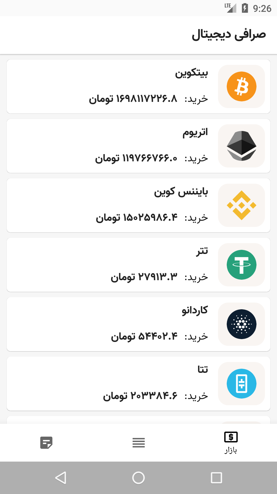
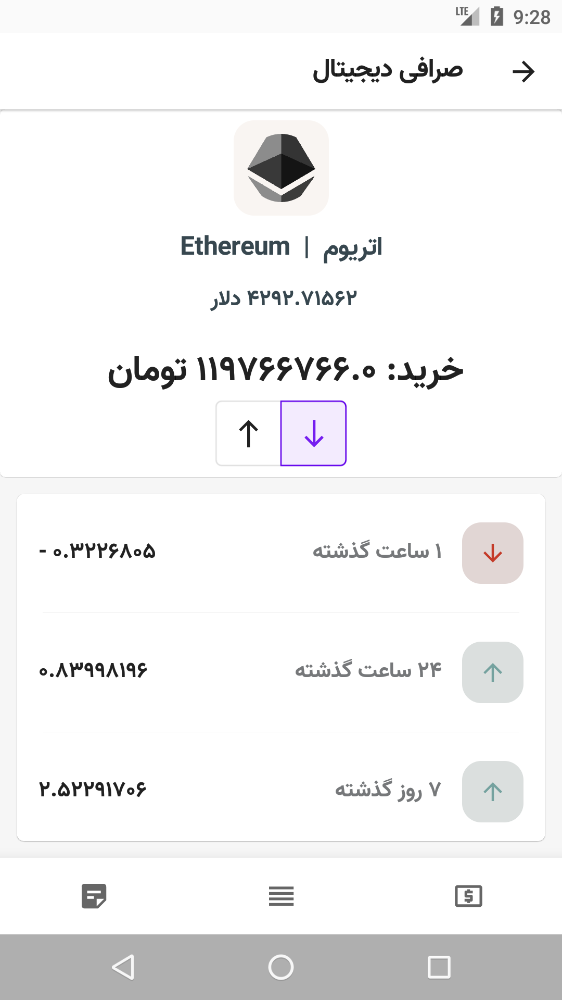

# jetpack_compose_mvvm
 

- [jetpack compose](https://developer.android.com/jetpack/compose)
- [Coroutines](https://developer.android.com/kotlin/coroutines) and flows
- Dependency Injection with [Koin](https://github.com/InsertKoinIO/koin "Koin") Library.
- Model View Intent Architecture - MVI.
- Clean Architecture approach.

## **Screen shot:** 
screen for product list, news list and product details
||||
|:----:|:----:|:----:|
